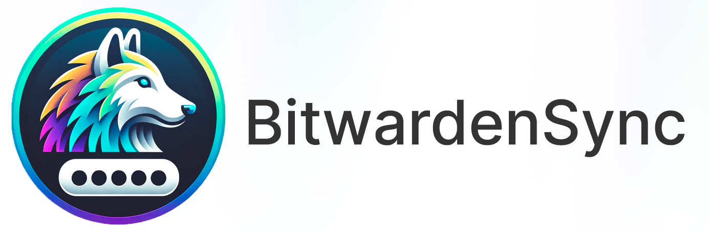

<p align="center">
    
</p>

<p align="center">Automatically Sync your Password Managers Data to Bitwarden/Vaultwarden</p>
<div align="center">
  <!-- Contributions Welcome Badge -->
  <a href="CODE_OF_CONDUCT.md" target="_blank">
    
  </a>
  <!-- Commits per Month -->
  <a href="https://github.com/NorkzYT/BitwardenSync/pulse">
    
  </a>
  <!-- License Badge -->
  <a href="https://github.com/NorkzYT/BitwardenSync/blob/main/LICENSE" target="_blank">
    
  </a>
  <!-- Contributor Covenant Badge -->
  <a href="https://contributor-covenant.org/version/2/1/code_of_conduct/" target="_blank">
    
  </a>
  <!-- Github Stars Badge -->
  <a href="https://github.com/NorkzYT/BitwardenSync/stargazers" target="_blank">
    
  </a>
</div>

## About

BitwardenSync is a docker service that will automatically Sync your Password Managers Data to your Bitwarden/Vaultwarden Instance.

## Getting Started

### Setup Instructions

1. Start by duplicating the `.env.example` file, renaming the duplicate to `.env`. Fill in the required fields within `.env`.

- Supported [import formats](https://github.com/bitwarden/clients/blob/34a766f346d829a15e348038a12c0c1aefb17457/libs/importer/src/models/import-options.ts#L6).

2. Proceed to craft your `docker-compose.yml` file, tailoring it to your environment.

## Usage

### Regular Backups with Cron

BitwardenSync can be integrated into your existing backup schedule using Cron. Here is an example to run backups every Friday at 22:00:

```bash
echo "0 22 * * 5 /opt/BitwardenSync/backup_schedule_example.sh >> /var/log/backup_schedule_example.log 2>&1" | crontab -
```

Refer to the provided [example script](./backup_schedule_example.sh) for a template on setting up scheduled backups for BitwardenSync.

## Contributing

Please see the [contributing guide](./CONTRIBUTING.md)

## Credits

Created by NorkzYT with 💛

► Twitch <https://www.twitch.tv/polymathnorkz>

► Discord <https://discord.com/users/282100214024896522>

► GitHub <https://github.com/NorkzYT>

<details>
<summary>Click to expand the repo tree</summary>

<!-- tree generated by repoTree.py starts here -->

  - [.env.example](./.env.example)
  - [**.github**](./.github)
    - [CODEOWNERS](./.github/CODEOWNERS)
    - [FUNDING.yml](./.github/FUNDING.yml)
    - [**ISSUE_TEMPLATE**](./.github/ISSUE_TEMPLATE)
      - [bug_report.yml](./.github/ISSUE_TEMPLATE/bug_report.yml)
      - [feature_request.yml](./.github/ISSUE_TEMPLATE/feature_request.yml)
    - [PULL_REQUEST_TEMPLATE.md](./.github/PULL_REQUEST_TEMPLATE.md)
    - [**workflows**](./.github/workflows)
      - [docker-build-publish.yml](./.github/workflows/docker-build-publish.yml)
      - [gitlab-sync.yml](./.github/workflows/gitlab-sync.yml)
  - [.gitignore](./.gitignore)
  - [CODE_OF_CONDUCT.md](./CODE_OF_CONDUCT.md)
  - [CONTRIBUTING.md](./CONTRIBUTING.md)
  - [LICENSE](./LICENSE)
  - [Makefile](./Makefile)
  - [README.md](./README.md)
  - [backup_schedule_example.sh](./backup_schedule_example.sh)
  - [commitlint.config.cjs](./commitlint.config.cjs)
  - [**docker**](./docker)
    - [**config**](./docker/config)
    - [**data**](./docker/data)
    - [entrypoint.sh](./docker/entrypoint.sh)
    - [vaultPurge.ts](./docker/vaultPurge.ts)
  - [docker-compose.dev.yml](./docker-compose.dev.yml)
  - [docker-compose.yml](./docker-compose.yml)
  - [dockerfile](./dockerfile)
  - [**docs**](./docs)
    - [**content**](./docs/content)
      - [**assets**](./docs/content/assets)
        - [**img**](./docs/content/assets/img)
          - [bitwardensync-cover-rl.png](./docs/content/assets/img/bitwardensync-cover-rl.png)
      - [bitwardensync-cover.psd](./docs/content/bitwardensync-cover.psd)
  - [package-lock.json](./package-lock.json)
  - [package.json](./package.json)
  - [renovate.json](./renovate.json)
  - [repoTree.py](./repoTree.py)
  - [tsconfig.json](./tsconfig.json)

